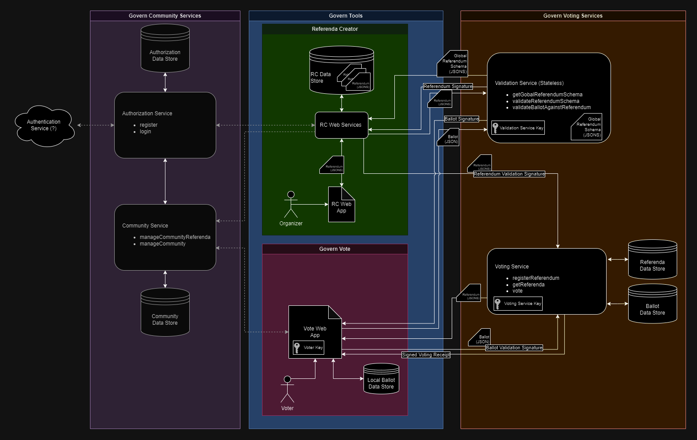

# System design

## Govern voting services

1. [Validation Service](./VALIDATION_SERVICE.md) - Stateless service for validating referenda and ballot structure
2. [Voting Service](./VOTING_SERVICE.md) - Stateful service for registering referenda and accepting votes

## Terminology

- **Referendum**: A set of measures to be voted on (plural: *referenda*).
- **Ballot**: A set of votes on the measures of a referendum.
